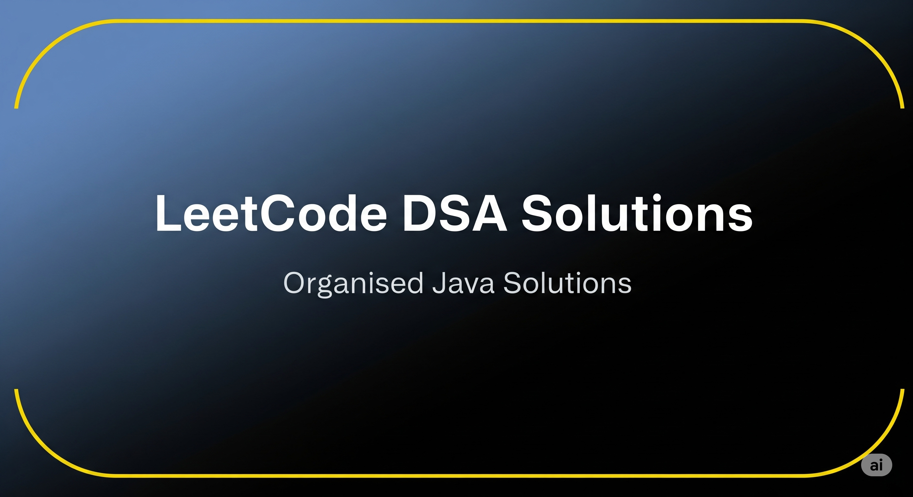
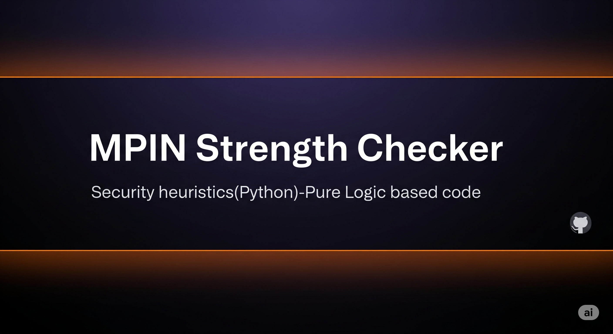

  

<h1 align="center">Hi, I'm <strong>Aditya Dorwal</strong> 👋</h1>

  

  
  
  
  

---

## 🔥 About
I turn research ideas into **usable, fast demos**. Recently exploring **real‑time speech transcription**, **explainable computer vision**, and **efficient ML pipelines**.

- 🎓 B.Tech (AIML), KCC — 3rd year
- 🧠 Interested in: **Whisper.cpp**, **Grad‑CAM**, **local LLMs**, and **offline‑first AI tools**
- 🤝 Open to: **SDE/ML internships**, open‑source collabs
- ⚡ Real-time speech & local AI tools
- 🔍 Explainable CV with sleek UX
- 🧪 Rapid prototyping → polished demos
- ☕ Coffee → Code → Ship → Repeat

I'm a 3rd-year B.Tech student in AIML, passionate about building high-performance AI applications that run at the edge. I believe in the power of **offline-first AI** 🔌, creating solutions that are fast, dependable, and privacy-focused.

My projects often involve transforming raw research ideas into polished, usable demos. This includes my work on **real-time speech systems using `Whisper.cpp`** 🗣️ and **explainable computer vision with `Grad-CAM`** 👁️.

I'm driven by a simple goal: to build efficient, clean, and real-world-ready technology. I'm actively seeking opportunities to apply my skills in **SDE/ML internships** and contribute to open-source projects. 🤝

---

### 🧠 My Core Focus

* **Offline-first AI:** Building local, dependency-light AI models. 🚀
* **Speech Systems:** Real-time transcription and hotword detection. 🎙️
* **Explainable AI:** Making complex models more transparent. ✨
* **Java & Python:** Crafting robust backend logic and efficient ML pipelines. ☕

---

## 🚀 Featured Projects
### 1. Plant Disease Detection

ResNet18 • Grad-CAM • Streamlit

---

### 2. Whisper.cpp Transcriber (RT)

VAD • Hotword • Async

---

### 3. Dorwal AI — Assistant

Local LLM • NLP • Desktop

---

### 4. LeetCode DSA Solutions

Organized Java Solutions

---

### 5. MPIN Strength Checker

Security heuristics (Python)

---

## 📊 Live Stats

  

  
  

---

## 📝 Recent Posts

---

## 📫 Contact
LinkedIn · Portfolio · Email

---

Made with ❤️ — Smooth, lightweight animations • Dark & Light variants included

