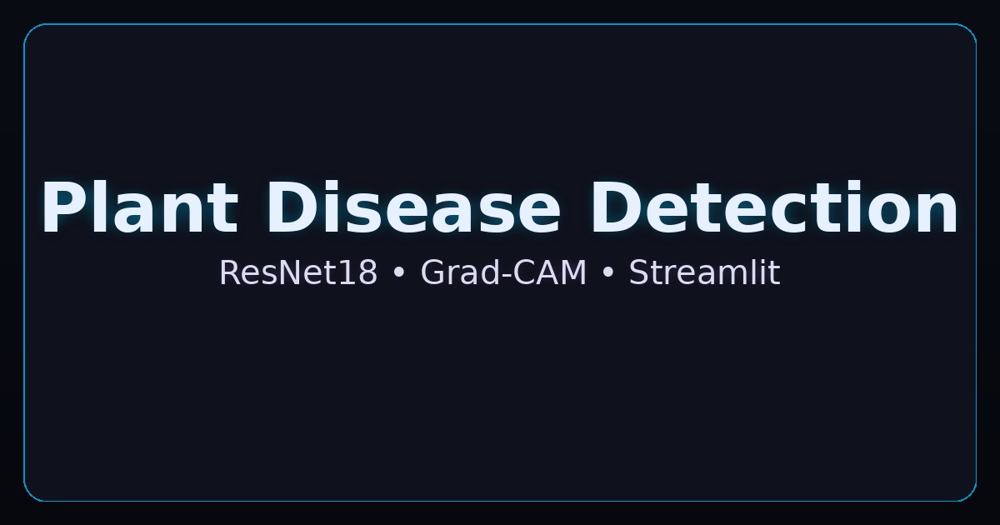
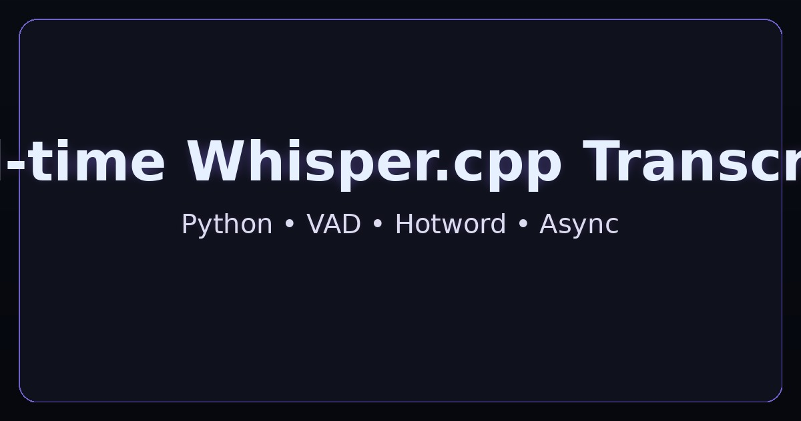
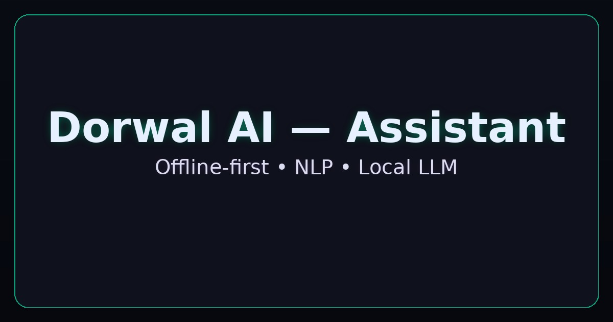

  

<h1 align="center">Hi, I'm <strong>Aditya Dorwal</strong> 👋</h1>

  <em>AI Engineer • ML/DL • NLP • DSA</em> 
  I build fast, practical AI tools with clean code and an open-source mindset.

  
  

---

## 🔥 TL;DR
I specialize in **real‑time speech transcription**, **explainable CV**, and **efficient ML pipelines**. I like turning research into clean, usable demos.

---

## 🧰 Tech Stack

  
  
  
  
  
  
  
  
  
  
  

---

## 🚀 Featured Projects

### 🌱 Plant Disease Detection — <a href="https://plant-disease-detection-hvxzmj8lebsnzvp7crta23.streamlit.app">Live Demo</a>

> ResNet18 classifier (38 classes) with Grad‑CAM heatmaps for explainability. Built with PyTorch + Streamlit.

---

### 🎙️ Real‑time Whisper.cpp Transcriber (WIP)

> Mic input → chunking → mono fallback → VAD + hotword → threaded processing. Designed for low‑latency transcription.

---

### 🤖 Dorwal AI — Personal Assistant (Concept)

> Offline‑first desktop assistant. Goal: local LLMs + NLP + intent routing with smooth UX.

---

## 📊 Stats

  

  
  

---

## 📝 Recent Posts
This section can auto‑update via GitHub Actions using your blog RSS feed (Dev.to / Medium). See workflows included in this repo pack.

---

## 📫 Connect
<a href="https://www.linkedin.com/in/adityadorwal">LinkedIn</a> · <a href="https://adityadorwal.github.io/portfolio/">Portfolio</a> · <a href="mailto:dorwaladitya18@gmail.com">Email</a>

---

Made with ❤️ — smooth, minimal animation • optimized for dark mode
