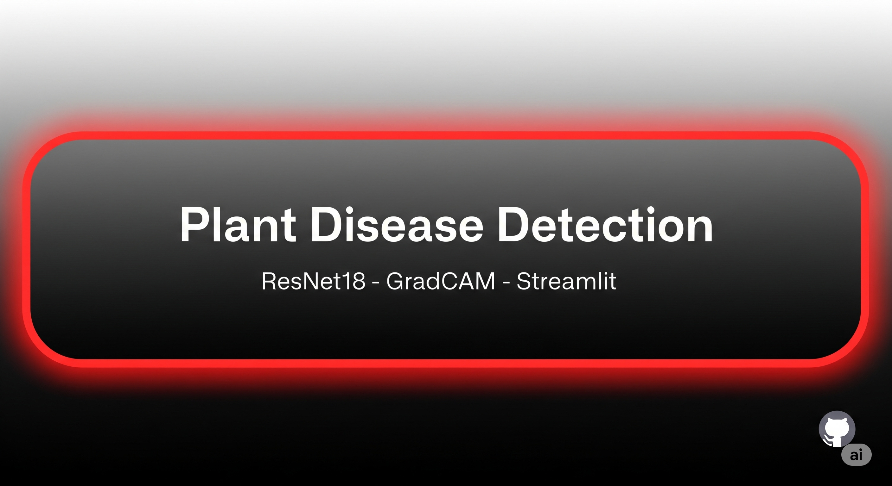
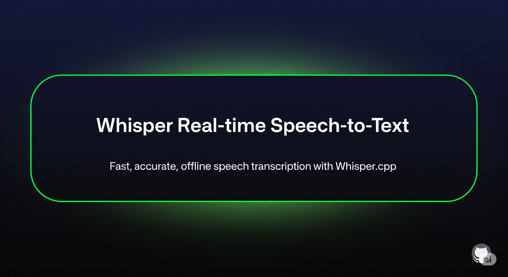
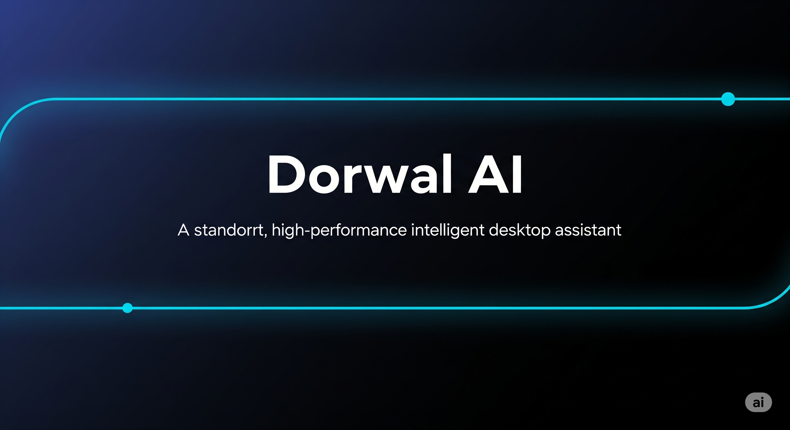

  

<h1 align="center">
  Hi, I'm <strong>Aditya Dorwal</strong>
  
</h1>

  

  
  
  
  

---

# 🚀 About Me

I build **real-world AI systems** by turning research ideas into usable software.

My work focuses on practical machine learning applications such as:

• real-time speech systems
• explainable computer vision
• NLP-powered assistants
• efficient ML pipelines

🎓 **B.Tech — Computer Science (AI & ML)**
KCC Institute of Technology and Management

⚙️ **Current Interests**

* Whisper.cpp & real-time inference
* Explainable AI (Grad-CAM)
* Local LLMs and offline AI tools
* Applied ML system design

🤝 Open to **AI / ML / SDE internships** and open-source collaboration.

---

# 🧠 Tech Stack

### Languages

Python • Java • C++ • JavaScript

### AI / ML

PyTorch • TensorFlow • Scikit-Learn • NLP • Computer Vision • Generative AI

### Development

Git • Streamlit • REST APIs • Web Development

---

# 🔥 Featured Projects

### 🌿 Plant Disease Detection

Deep learning system for plant disease classification using **ResNet18 + Grad-CAM** for explainability.
Built with **PyTorch** and deployed using **Streamlit** for an interactive interface.

---

### 🎙 Real-Time Speech Transcriber

Low-latency speech transcription tool built using **Whisper.cpp**.
Integrates **Voice Activity Detection (VAD)** and **hotword activation** to create an efficient streaming inference pipeline.

---

### 🤖 Dorwal AI — Local Assistant

Privacy-focused desktop AI assistant powered by a **local LLM**.
Processes natural language queries locally for offline automation and interaction.

---

# 📊 GitHub Stats

  

  
  

---

# 📫 Connect With Me

  <a href="https://www.linkedin.com/in/aditya-dorwal-b4a488288/">LinkedIn</a> •
  <a href="https://adityadorwal.github.io/portfolio/">Portfolio</a> •
  <a href="mailto:18dorwaladitya@gmail.com">Email</a>

---

  Building intelligent systems • Learning every day • Shipping code 🚀

