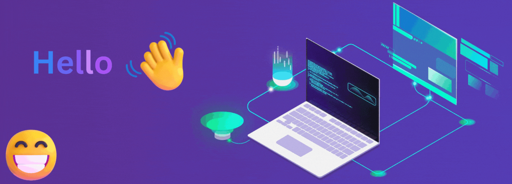

  

<h1 align="center">Hi, I'm <strong>Aditya Dorwal</strong> </h1>

  

  
  
  
  

---

## 🔥 About
I turn research ideas into **usable, fast demos**. Recently exploring **real‑time speech transcription**, **explainable computer vision**, and **efficient ML pipelines**.

- 🎓 B.Tech (AIML), KCC — 3rd year
- 🧠 Interested in: **Whisper.cpp**, **Grad‑CAM**, **local LLMs**, and **offline‑first AI tools**
- 🤝 Open to: **SDE/ML internships**, open‑source collabs
- ⚡ Real-time speech & local AI tools
- 🔍 Explainable CV with sleek UX
- 🧪 Rapid prototyping → polished demos
- ☕ Coffee → Code → Ship → Repeat
  
---

## 🚀 Featured Projects
### 1. Plant Disease Detection  

  

This project leverages deep learning to build an accurate and intuitive plant disease detection system. It utilizes a **ResNet18** model to classify plant leaf images, and integrates **Grad-CAM** to provide visual explanations of the model's predictions, making the AI's decision-making process transparent to the user. The application is deployed with **Streamlit** for a clean, user-friendly interface.  

---

### 2. Whisper.cpp Transcriber (RT)  

  

A real-time speech transcription tool built around **Whisper.cpp**. This project focuses on creating a highly efficient and low-latency system by incorporating **Voice Activity Detection (VAD)** to filter out silence and **hotword detection** for activation. The use of an **asynchronous architecture** ensures a smooth, non-blocking user experience, making it suitable for live-transcription tasks.  

---

### 3. Dorwal AI — Assistant  

  

A personal desktop assistant powered by a **Local LLM (Large Language Model)**, designed for privacy and offline use. The assistant processes natural language requests (**NLP**) directly on the user's machine, enabling a wide range of tasks from answering questions to automating workflows without an internet connection. This project highlights the potential of powerful, privacy-first desktop AI tools.  

---

## 📊 Live Stats

  

  
  

---

## 📝 Recent Posts
<!-- BLOG-POST-LIST:START -->
- *(loading…)*
<!-- BLOG-POST-LIST:END -->

---

---

  

## 📫 Contact
[LinkedIn](https://www.linkedin.com/in/aditya-dorwal-b4a488288/) · [Portfolio](https://adityadorwal.github.io/portfolio/) · [Email](18dorwaladitya@gmail.com)
---

Made with ❤️—A focus on a seamless user experience, including lightweight animations and Dark & Light variants.

